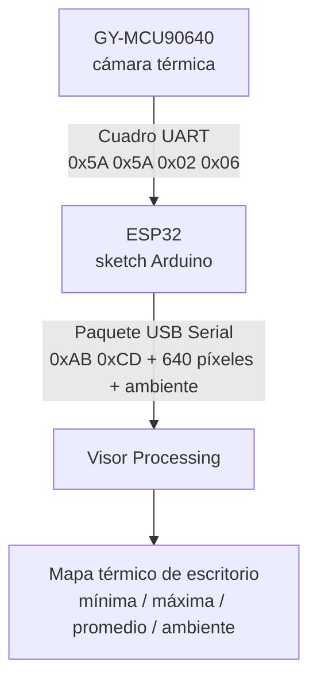
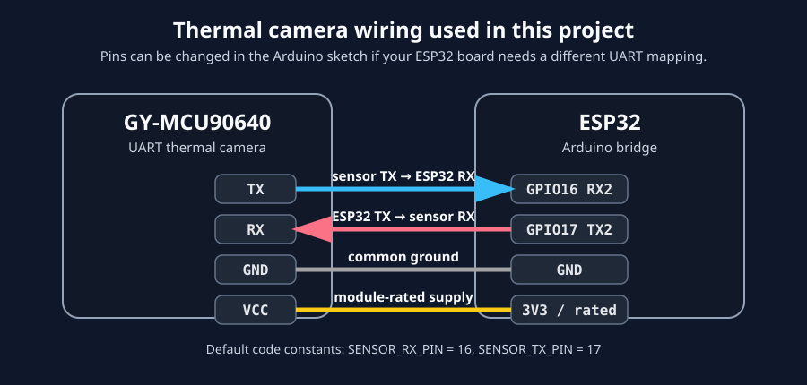

# La Camara

La Camara es un puente de cámara térmica ESP32 + GY-MCU90640 UART con un visor de escritorio en Processing. El ESP32 lee los cuadros térmicos del módulo de cámara y los envía a una computadora por USB Serial para visualizarlos en tiempo real.

[Read in English](README.md)

## Cómo funciona



1. El módulo GY-MCU90640 envía datos de imagen térmica al ESP32 por UART.
2. El sketch del ESP32 en `arduino/CamaraTermica/CamaraTermica.ino` interpreta cada cuadro y publica un paquete binario compacto por USB Serial.
3. El sketch de Processing en `processing/CamaraTermica/CamaraTermica.pde` lee el flujo USB Serial, decodifica los paquetes y muestra la vista térmica en el escritorio.

La información detallada sobre paquetes y cuadros está documentada en [docs/protocol.md](docs/protocol.md).

## Estructura del repositorio

```text
arduino/
  CamaraTermica/               Puente ESP32 de GY-MCU90640 UART a USB Serial
processing/
  CamaraTermica/               Sketch del visor térmico en Processing y recursos
docs/
  hardware.md                  Notas sobre componentes y dependencias
  wiring.md                    Mapa de pines y guía de cableado
  protocol.md                  Formato de cuadros térmicos por serial
  calibration.md               Notas de calibración térmica
```

## Resumen de hardware

- Placa de desarrollo ESP32
- Módulo de cámara térmica GY-MCU90640 con salida UART
- Cable USB hacia la computadora que ejecuta Processing



Este diagrama muestra los pines usados en este proyecto: TX del sensor a GPIO16/RX2 del ESP32 y RX del sensor a GPIO17/TX2 del ESP32. Puedes cambiar esos pines en `arduino/CamaraTermica/CamaraTermica.ino` si tu placa ESP32 o tu cableado usa otra asignación UART.

Consulta [docs/hardware.md](docs/hardware.md) y [docs/wiring.md](docs/wiring.md).

## Inicio rápido

1. Abre `arduino/CamaraTermica/CamaraTermica.ino` en Arduino IDE.
2. Selecciona una placa ESP32 e instala el soporte para ESP32 si hace falta.
3. Conecta el módulo GY-MCU90640 UART a los GPIO16/GPIO17 del ESP32.
4. Carga el sketch.
5. Abre `processing/CamaraTermica/CamaraTermica.pde` en Processing.
6. Ejecuta el visor y conéctalo al puerto USB serial del ESP32 a `115200` baudios.

El visor imprime los puertos serial disponibles en la consola de Processing. Si hay varios puertos, configura `SERIAL_PORT_INDEX` o `SERIAL_PORT_NAME` cerca del inicio de `CamaraTermica.pde` y ejecútalo de nuevo.

## Visor en Processing

El visor en Processing está incluido en `processing/CamaraTermica/CamaraTermica.pde`, con su recurso de fuente en `processing/CamaraTermica/data/`.

Para ejecutarlo, instala Processing, abre el archivo PDE, conecta el ESP32 que ejecuta `arduino/CamaraTermica/CamaraTermica.ino` y presiona Run. El sketch usa la biblioteca Serial integrada a `115200` baudios.

## Licencia

MIT. Consulta [LICENSE](LICENSE).
