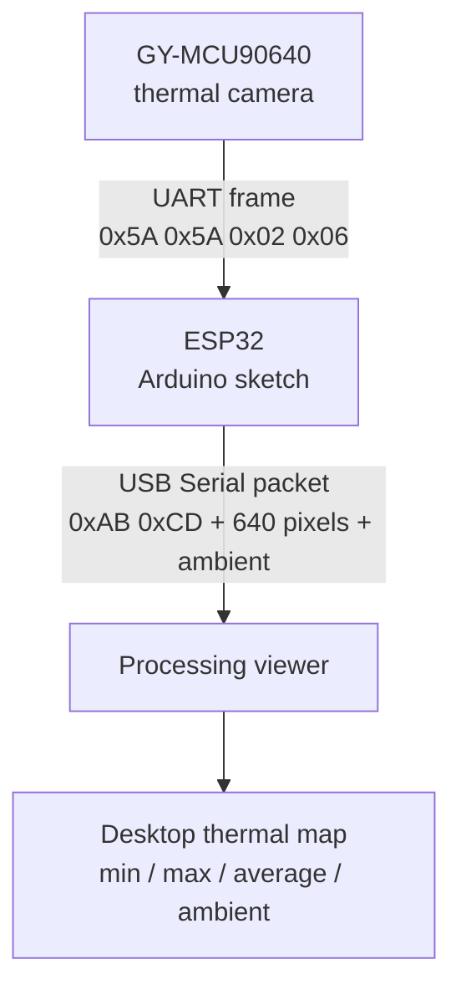

# La Camara

La Camara is an ESP32 + GY-MCU90640 UART thermal camera bridge with a Processing desktop viewer. The ESP32 reads thermal frames from the camera module and streams them to a computer over USB Serial for real-time visualization.

[Leer en español](README.es.md)

## How it works



1. The GY-MCU90640 module sends thermal image data to the ESP32 over UART.
2. The ESP32 sketch at `arduino/CamaraTermica/CamaraTermica.ino` parses each frame and publishes a compact binary packet over USB Serial.
3. The Processing sketch at `processing/CamaraTermica/CamaraTermica.pde` reads the USB Serial stream, decodes the packets, and renders the thermal view on the desktop.

Detailed packet and frame information is documented in [docs/protocol.md](docs/protocol.md).

## Repository layout

```text
arduino/
  CamaraTermica/               ESP32 bridge from GY-MCU90640 UART to USB Serial
processing/
  CamaraTermica/               Processing thermal viewer sketch and data assets
docs/
  hardware.md                  Parts and dependency notes
  wiring.md                    Pin map and wiring guidance
  protocol.md                  Thermal serial frame format
  calibration.md               Thermal calibration notes
```

## Hardware summary

- ESP32 development board
- GY-MCU90640 thermal camera module with UART output
- USB cable to the computer running Processing

See [docs/hardware.md](docs/hardware.md) and [docs/wiring.md](docs/wiring.md).

## Quick start

1. Open `arduino/CamaraTermica/CamaraTermica.ino` in Arduino IDE.
2. Select an ESP32 board and install ESP32 board support if needed.
3. Wire the GY-MCU90640 UART module to ESP32 GPIO16/GPIO17.
4. Upload the sketch.
5. Open `processing/CamaraTermica/CamaraTermica.pde` in Processing.
6. Run the viewer and connect it to the ESP32 USB serial port at `115200` baud.

The viewer prints available serial ports in the Processing console. If there are multiple ports, set `SERIAL_PORT_INDEX` or `SERIAL_PORT_NAME` near the top of `CamaraTermica.pde` and run it again.

## Processing viewer

The Processing viewer is included at `processing/CamaraTermica/CamaraTermica.pde`, with its font asset under `processing/CamaraTermica/data/`.

To run it, install Processing, open the PDE file, connect the ESP32 running `arduino/CamaraTermica/CamaraTermica.ino`, and press Run. The sketch uses the built-in Serial library at `115200` baud.

## License

MIT. See [LICENSE](LICENSE).
